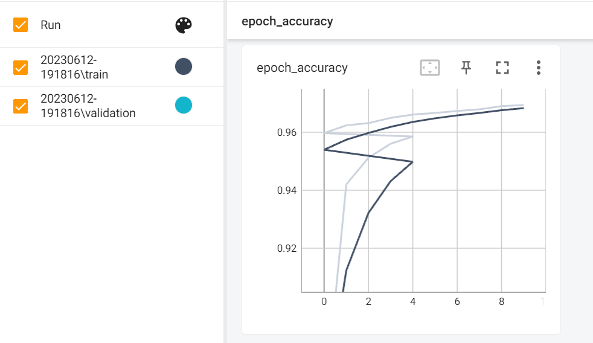
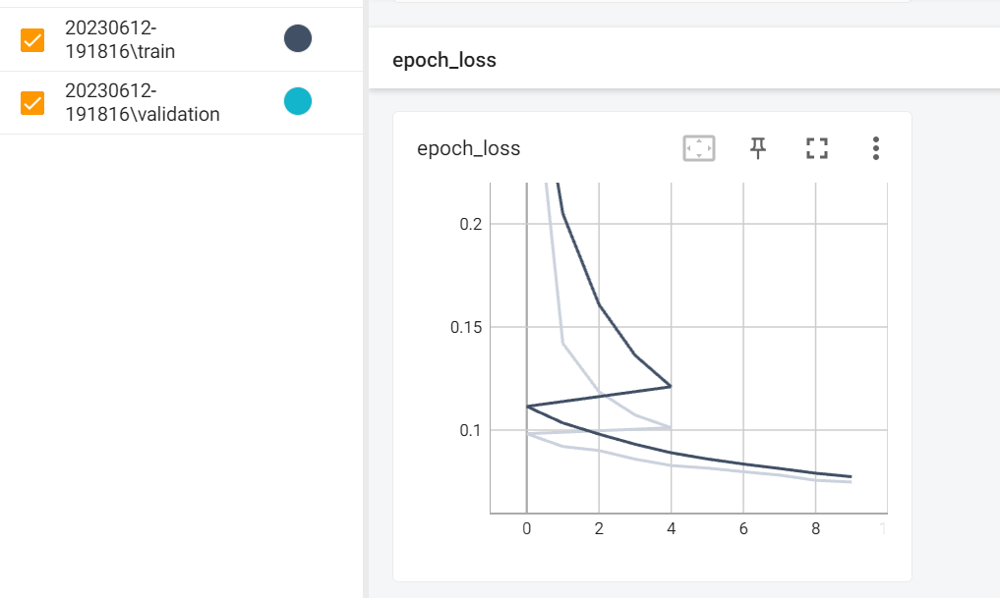
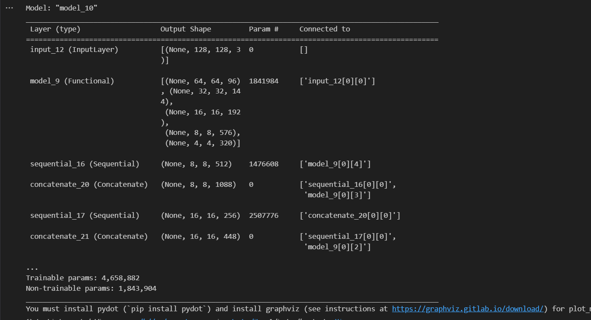
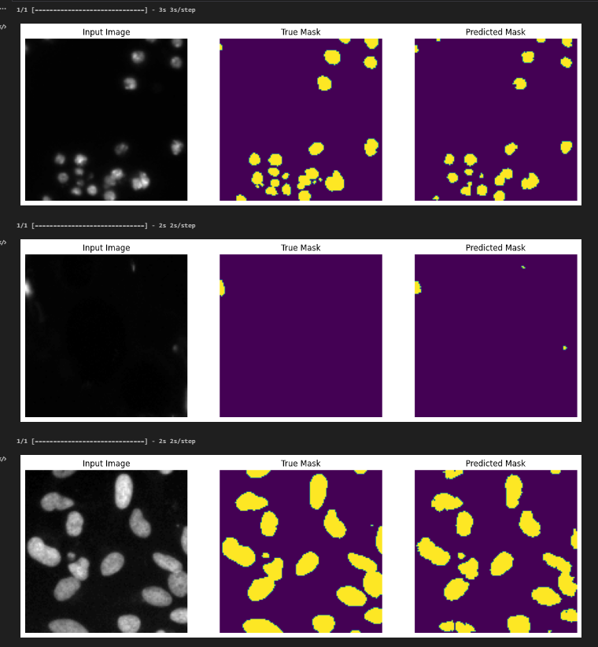

# Cell Nuclei Semantic Segmentation
This project aims to develop an algorithm for semantic segmentation that can automatically detect nuclei in images. The algorithm has the potential to expedite research in various diseases, including cancer, heart disease, and rare disorders, by enabling researchers to analyze the DNA contained within cell nuclei. This genetic information plays a crucial role in determining the function of each cell and understanding the underlying biological processes.

## Dataset
The dataset used for this project is sourced from the Data Science Bowl 2018 competition on Kaggle. You can find the dataset here https://www.kaggle.com/competitions/data-science-bowl-2018/overview. Please download the file and extract it to the appropriate directory.

## Usage
### 1. Navigate to the project directory:
```shell
cd your-repository
```
NOTES: make sure you replace 'your-repositary' with the correct name
### 2. Run the main script:
```shell
python farahAI03_capstone4_cell.ipynb
```
## Data Preparation
The dataset is expected to be located in the following directory structure:

└── data-science-bowl-2018

    ├── train 
    │   ├── inputs
    │   │   ├── image1.png
    │   │   ├── image2.png
    │   │   └── ...
    │   └── masks
    │       ├── mask1.png
    │       ├── mask2.png
    │       └── ...
    └── test
        ├── inputs
        │   ├── image1.png
        │   ├── image2.png
        │   └── ...
        └── masks
            ├── mask1.png
            ├── mask2.png
            └── ...
Ensure that you have the necessary permissions to access the dataset files.

## Model Architecture
The model used in this project is a U-Net, which is a popular architecture for image segmentation tasks. It consists of an encoder (downsampling path) and a decoder (upsampling path) to capture high-level and low-level features of the input images.

The U-Net architecture has the following components:
- Pretrained model (MobileNetV2) as the feature extractor.
- Skip connections between the encoder and decoder to preserve spatial information.
- Upsampling layers to increase the resolution of the feature maps.
- The model architecture can be visualized using the provided diagram.

## Training
To train the model, follow these steps:
- Set the file paths for the train and test datasets in the code.
- Adjust the hyperparameters (e.g., batch size, learning rate) if needed.
- Run the training script.
- The training process will involve the following steps:

1. Load and preprocess the input and mask images.
2. Create data augmentation layers to improve the model's generalization.
3. Build the U-Net model using the specified architecture.
4. Compile the model with the appropriate loss function and optimizer.
5. Train the model using the training dataset.
6. Monitor the training progress using TensorBoard.
7. Evaluate the model's performance on the testing dataset.

## Evaluation
After training the model, it can be evaluated using the testing dataset. The evaluation process includes the following steps:
- Load the trained model weights.
- Preprocess the input and mask images from the testing dataset.
- Run the evaluation script.
- Compute the metrics (e.g., accuracy, loss) to assess the model's performance.

## Installation
### 1. Clone the repository to your local machine using the following command:
```shell
git clone https://github.com/farah2p/farah-capstone4-cell.git
```
### 2. Before running the code, ensure that you have the following dependencies installed:
- TensorFlow
- Pandas 1.5.3
- Matplotlib
- Tensorboard 2.12.3

Install the required dependencies by running the following command:
```shell
pip install tensorflow==2.12.0
pip install numpy==1.24.2
pip install matplotlib==3.7.1
pip install pandas==1.5.3
pip install tensorboard===2.12.3
```
### 3. Download the dataset from the provided Kaggle link and place it in the project directory.
### 4. Open the Jupyter Notebook or Python script containing the code.
### 5. Run the code cells or execute the script to perform data preprocessing, model training, and evaluation.
### 6. Use Tensorboard to visualize the model graph and training progress by running the following command in the project directory:
```shell
tensorboard --logdir tensorboard_logs/capstone4
```
Access Tensorboard in your web browser using the provided URL.
### 7. The trained model will be saved in the "saved_models" folder in .h5 format as model.h5

## Project Requirements
- Python
- TensorFlow library

## Results
After training the semantic segmentation model using a deep learning framework, it was trained for 10 epochs, where each epoch consisted of several steps. Throughout the training process, the loss and accuracy metrics were monitored to assess the model's performance. By employing a U-Net-based architecture for Cell Nuclei Segmentation, the following noteworthy results were obtained:

Here is a summary of the loss and accuracy metrics for each epoch:

- Epoch 1/10: Loss: 0.0982, Accuracy: 0.9597
- Epoch 2/10: Loss: 0.0920, Accuracy: 0.9624
- Epoch 3/10: Loss: 0.0901, Accuracy: 0.9632
- Epoch 4/10: Loss: 0.0859, Accuracy: 0.9650
- Epoch 5/10: Loss: 0.0828, Accuracy: 0.9661
- Epoch 6/10: Loss: 0.0816, Accuracy: 0.9667
- Epoch 7/10: Loss: 0.0798, Accuracy: 0.9673
- Epoch 8/10: Loss: 0.0782, Accuracy: 0.9679
- Epoch 9/10: Loss: 0.0756, Accuracy: 0.9690
- Epoch 10/10: Loss: 0.0748, Accuracy: 0.9694

### Sample Predictions
After each epoch, sample predictions were generated to visually assess the model's performance. These predictions provide an understanding of how well the model is able to segment and detect cell nuclei in the given images. Please refer to the project report for the visual representations of the sample predictions generated after each epoch.

### Model Evaluation on Test Dataset
To assess the performance of the developed semantic segmentation model on unseen data, it was evaluated on a separate test dataset. The evaluation provides valuable insights into how well the model generalizes to new images and its overall effectiveness in detecting and segmenting cell nuclei.

The model was evaluated using the test dataset, which consisted of a set of images with ground truth annotations. Here are the evaluation results:
- Loss: 0.0899
- Accuracy: 96.32%

The computed metrics provide a quantitative measure of the model's performance. The lower the loss value, the better the model's predictions align with the ground truth annotations. Additionally, the accuracy metric indicates the percentage of correctly classified pixels in the test dataset.

These results demonstrate that the developed semantic segmentation model achieves a high level of accuracy, accurately identifying and segmenting cell nuclei in the test images.

### Conclusion
The developed semantic segmentation model shows promising results in detecting and segmenting cell nuclei in images. With its high accuracy and progressively decreasing loss values over the epochs, the model has the potential to streamline research processes in various diseases. By automating the identification of cell nuclei, researchers can expedite their analysis of cellular responses to different treatments, leading to faster insights into the underlying biological processes and ultimately expediting the development of cures and new drugs for the benefit of patients worldwide.

The robust performance of the model on the test dataset reinforces its potential as a valuable tool in expediting research on various diseases, including cancer, heart disease, and rare disorders. By automating the detection of cell nuclei, researchers can analyze the DNA contained within these nuclei, gaining valuable insights into cellular responses to different treatments and facilitating the development of new drugs and cures.

Overall, the evaluation results suggest that the developed model holds promise for advancing research in the biomedical field and has the potential to significantly impact the speed at which cures are developed, benefitting individuals suffering from a wide range of health conditions.

### Below are some sample visualizations generated by the project:

- Tensorboard Epoch Accuracy:



- Tensorboard Epoch Loss:



- Model Architecture:



- To showcase the model's performance on the test dataset, the `show_predictions` function was used to visualize the segmentation results of three sample images. And here is the output:



The output displays the original images alongside their corresponding segmented cell nuclei. This demonstration provides a visual representation of the model's accuracy and its ability to effectively detect and segment cell nuclei in real-world images.

## Credits
The dataset used in this project is sourced from Kaggle:
https://www.kaggle.com/competitions/data-science-bowl-2018/overview

## Contributing
Contributions to this project are welcome. If you find any issues or have suggestions for improvement, please open an issue or submit a pull request on the GitHub repository.
